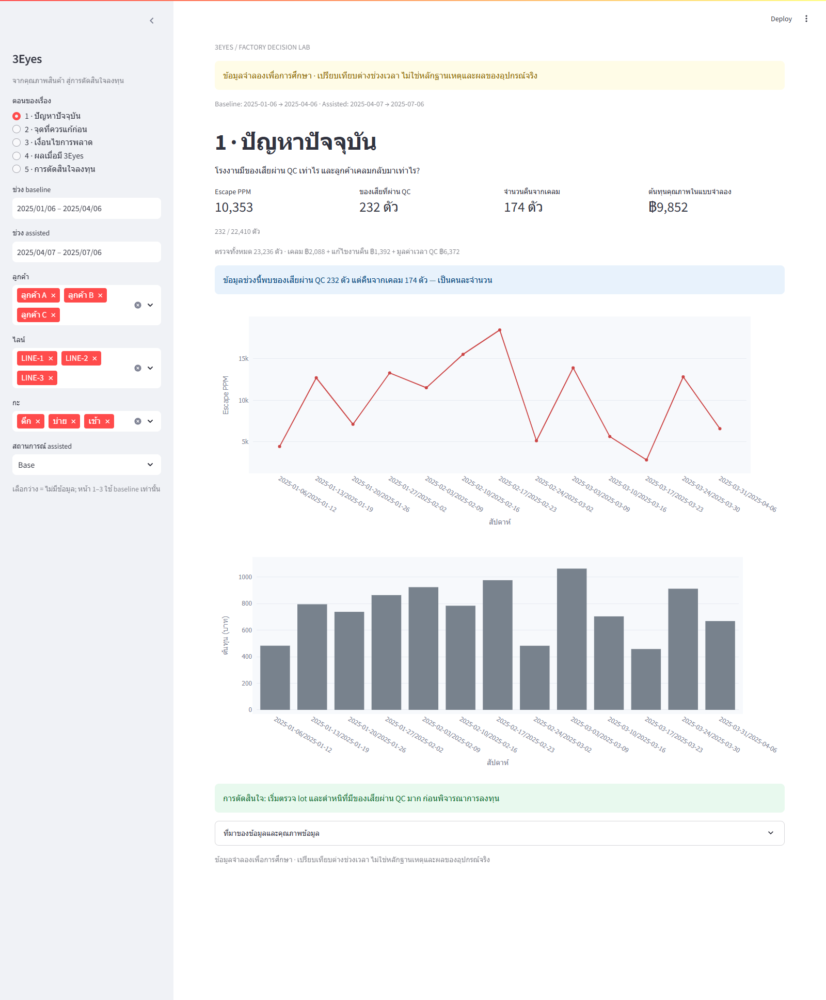

# 3Eyes — จากคุณภาพสินค้า สู่การตัดสินใจลงทุน

## Continue in a new Codex session

Open this folder, then ask Codex to read [AGENTS.md](AGENTS.md) and [session notes](docs/SESSION_NOTES.md) before continuing. The existing plan is [PLAN_3Eyes_DW_Dashboard.md](PLAN_3Eyes_DW_Dashboard.md). No additional initialization is needed to run the existing dashboard.

With the included virtual environment, run `.\.venv\Scripts\python.exe run.py app` and open http://localhost:8501. The visual refresh uses navy, teal, indigo, and colorful category charts. Shared styling lives in `dashboard/style.py` and `.streamlit/config.toml`. The optional [Power BI theme](config/powerbi_theme.json) can be imported in Power BI Desktop; it is a color theme rather than a complete report.

> **ข้อมูลจำลองเพื่อการศึกษา** ไม่ใช่ผลทดสอบอุปกรณ์จริง: โรงงานมีของเสียหลุดจากจุดใด 3Eyes ช่วยลดความเสี่ยงได้แค่ไหน และต้องมีปริมาณงานเท่าไรจึงคุ้มลงทุน?

Streamlit + SQLite, 5 หน้าจากปัญหา QC ไปถึง ROI ใช้ seed 42, 26 สัปดาห์, 120 lots และ 7 ประเภทตำหนิ + งานดี 1 กลุ่ม จำนวนตรวจ **97,717 แถว** แทน **48,063 น็อตจำลองไม่ซ้ำ**; assisted ทั้ง 3 สถานการณ์เป็นน็อตชุดเดียวกัน ห้ามนำมารวมเป็นยอดผลิต มีเคลม 416 แถว (จำนวนแถวไม่ใช่จำนวนคืน)

## เปิด Dashboard

- ในเครื่อง: [http://localhost:8501](http://localhost:8501) หลังรันคำสั่งด้านล่าง
- เว็บสาธารณะ: **ยังไม่เผยแพร่** — การเก็บโค้ดบน GitHub ไม่ได้เปิดใช้งาน Streamlit Community Cloud โดยอัตโนมัติ และยังไม่มี URL ของแอปสาธารณะที่ยืนยันแล้ว
- Repository เป้าหมาย: [67160366/Data_Warehouse](https://github.com/67160366/Data_Warehouse), branch `main`, โฟลเดอร์ `MiniProject`

```powershell
python -m venv .venv
.\.venv\Scripts\Activate.ps1
python -m pip install -r requirements.txt
python run.py app
```

ใช้ Python **3.11** มี CSV และ SQLite snapshot ที่ตรวจแล้วแนบมาจึงเปิดแอปได้ทันที แอปเปิด SQLite แบบอ่านอย่างเดียวและ cache ตามรุ่นข้อมูล ไม่โหลด ETL ระหว่างผู้ชมเข้าเว็บ บน macOS/Linux ใช้ `source .venv/bin/activate`

สร้างใหม่จากต้นทางและทดสอบ:

```powershell
python run.py all
```

`all` สร้างข้อมูล → reset ฐาน → ETL → validation → tests หรือรันแยก `python run.py data`, `python run.py etl --reset`, `python run.py test` ได้ Tests สร้างฐานชั่วคราวแยกจาก snapshot และไม่เรียก `all` ซ้ำ

## สมาชิก

| ชื่อ-สกุล | รหัสนักศึกษา | หน้าที่ |
|---|---|---|
| นายรณชัย ขาวสะอาด | 67160366 | รอทีมยืนยันหน้าที่จริง |

ชื่อและรหัสข้างต้นมาจาก README เดิม ยังไม่ได้รับข้อมูลหน้าที่หรือสมาชิกเพิ่มเติม จึงไม่เติมข้อมูลบุคคลโดยคาดเดา

## ข้อมูลและหลักฐานส่งงาน

| รายการ | ไฟล์ |
|---|---|
| CSV UTF-8-SIG ทั้ง 7 dimensions + 2 facts | [data/raw](data/raw) |
| SQLite snapshot | [threeeyes_dw.db](data/warehouse/threeeyes_dw.db) |
| ชนิดข้อมูล หน่วย NULL และความหมายทุกคอลัมน์ | [Data dictionary](data/data_dictionary.md) |
| Star Schema | [แผนผัง](docs/star_schema.md) |
| สูตร KPI และ ROI พร้อมตัวอย่างคำนวณ | [KPI definitions](docs/03_kpi_definitions.md) / [metrics.py](src/metrics.py) |
| สมมติฐานต้นทุนและเวลา พร้อมหน่วยและที่มา | [assumptions.csv](config/assumptions.csv) |
| พารามิเตอร์และสถานการณ์ | [generator_params.yaml](config/generator_params.yaml) |
| ขั้นตอน ETL และ quarantine | [ETL design](docs/04_etl_design.md) |
| รายงานคุณภาพและ hash ข้อมูล | [Quality report](reports/data_quality_report.md) / [manifest](reports/data_manifest.json) |
| ผลทดสอบและข้อมูลเสีย 10 แถว | [Verification](reports/verification.md) / [quarantine evidence](reports/quarantine_test.csv) |
| ภาพ Dashboard จริง 5 หน้า | [Screenshots](reports/screenshots) |
| ชุดส่งงานรวมโค้ด ข้อมูล และหลักฐาน | [threeeyes_submission.zip](reports/threeeyes_submission.zip) |

`CSV → staging → dimensions/facts → marts / SQL views → Streamlit`

ทุกอัตราแสดงจำนวนตัวอย่าง ตัวหาร 0 แสดง “คำนวณไม่ได้” เลือกตัวกรองว่างแสดงไม่มีข้อมูล หน้า 1–3 ใช้ baseline; หน้า 4–5 แยกช่วง baseline และ assisted หากขาดฝั่งใดไม่คำนวณ ROI

## ข้อสรุปจากข้อมูลเริ่มต้น

Baseline 91 วันมี 23,236 ตัว ปริมาณเริ่มต้นประมาณ 7,772 ตัว/เดือน ต้นทุน manual ประมาณ 0.4240 บาท/ตัว และ Base ประมาณ 0.3338 บาท/ตัว แต่ค่าบริการ 5 เครื่องรวม 1,500 บาท/เดือน ทำให้ Base มีผลประหยัดหลังค่าบริการประมาณ **−800 บาท/เดือน จึงไม่คืนทุนภายใต้สมมติฐานนี้** ผู้ชมปรับปริมาณงานเพื่อดูว่าเมื่อใดครอบคลุมค่าบริการและเงินลงทุนได้

สูตรเดียวกันในตารางและกราฟ: `(ต้นทุน manual/ตัว − ต้นทุน assisted/ตัว) × ปริมาณ/เดือน − ค่าบริการ` คิด ROI ที่ 6 เดือน และแสดงกราฟ 24 เดือน มูลค่าเวลาเป็น **ผลประโยชน์เทียบเท่าค่าแรง** ไม่ใช่เงินสดที่ประหยัดจริงทั้งหมด

## ข้อจำกัดแบบจำลอง

- ต่างช่วงเวลาระหว่าง manual/assisted ไม่ใช่การทดลองเพื่อพิสูจน์เหตุและผล
- ปัจจัยชั่วโมง กะ ประสบการณ์ และแสงเกิดจากสมมติฐาน; ชั่วโมงกะ 1–8 และช่วงปลายกะ 7–8
- หนึ่งตำหนิหลักต่อน็อต หนึ่ง lot อยู่วันและกะเดียว เคลมลงวันเดียวกับ lot; ของเสียที่ผ่าน QC ต่างจากจำนวนที่ลูกค้าพบและคืน
- ผลเครื่องสุ่มด้วยความน่าจะเป็น ไม่มี anomaly score หรือ strictness slider; FAIL/UNCERTAIN เพิ่มเวลายืนยันสมมติ 5 วินาที
- Device False Alarm ต่างจาก Final False Reject; Override Rate ไม่ใช่ความเชื่อใจโดยตรง
- ต้นทุนรวมเฉพาะเคลม แก้ไขงานคืน และมูลค่าเวลา QC; ROI เพิ่มค่าเครื่องและบริการ ไม่รวมต้นทุนงานดีคัดทิ้ง ค่าบำรุงรักษา ดอกเบี้ย และภาษี
- กำลังตรวจเป็นเชิงทฤษฎีต่อชั่วโมงทำงาน ไม่รวมเวลาหยุดพัก

บริบทต้นทาง: [3Eyes brief](https://github.com/67160366/3eyes-anomaly-detection/blob/master/docs/00_BRIEF.md)

## เผยแพร่บน Streamlit Community Cloud

1. นำโฟลเดอร์นี้ไปไว้ `MiniProject/` ใน repository เป้าหมาย และ push ทั้ง CSV, snapshot, โค้ด และเอกสาร `.gitignore` ยกเว้นเฉพาะ snapshot ส่งงานไว้แล้ว
2. เลือก repository `67160366/Data_Warehouse`, branch `main`, entrypoint `MiniProject/dashboard/app.py`, Python **3.11**
3. ใช้ `MiniProject/dashboard/requirements.txt` ซึ่งอ้างอิง `../requirements.txt` จึงใช้เวอร์ชันเดียวกัน ตรวจว่า repo ไม่มี environment file ชนิดอื่นข้าง entrypoint ที่มีลำดับความสำคัญสูงกว่า
4. เปิดเว็บตรวจทั้ง 5 หน้า แล้วใส่ URL จริงในหัวข้อ “เปิด Dashboard”

Streamlit ค้น dependency file ที่ root หรือข้าง entrypoint และรันจาก root ของ repository ตาม [คู่มือจัดโครงสร้างไฟล์](https://docs.streamlit.io/deploy/streamlit-community-cloud/deploy-your-app/file-organization) รายละเอียดขั้นเผยแพร่ดู [Deploy your app](https://docs.streamlit.io/deploy/streamlit-community-cloud/deploy-your-app/deploy)

## ภาพตัวอย่าง



[หน้า 2 — จุดที่ควรแก้ก่อน](reports/screenshots/page-2.png) · [หน้า 3 — เงื่อนไขการพลาด](reports/screenshots/page-3.png) · [หน้า 4 — ผลเมื่อมี 3Eyes](reports/screenshots/page-4.png) · [หน้า 5 — การตัดสินใจลงทุน](reports/screenshots/page-5.png)

สร้างภาพซ้ำเมื่อเปิดแอปแล้ว: `python -m pip install -r requirements-dev.txt` ตามด้วย `python scripts/capture_dashboard.py --executable "path/to/chrome"` ใช้ headless browser ไม่ต้องแก้ภาพด้วยมือ
