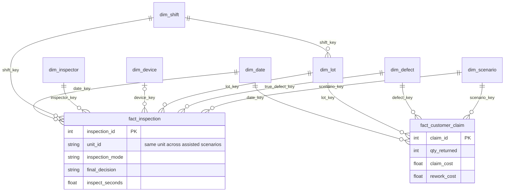

# Star Schema

Inspection grain: `unit_id × inspection_mode × scenario_key` (unique). Claim grain: lot × defect × scenario, บันทึกวันเดียวกับ lot; วันที่กะของการตรวจต้องตรง lot. ทั้งสอง facts ใช้ dimensions ร่วมกัน ข้อยกเว้นจาก star แบบบริสุทธิ์คือ `dim_lot.shift_key` เพื่อรับรองกะเดียวกัน

Mart `fact_lot_summary` สรุปหนึ่ง lot × mode × scenario. รวมยอดเคลมต่อ lot/scenario ก่อน join กับการตรวจ ห้าม join facts แบบแถวต่อแถวแล้ว SUM ค่าเคลม
